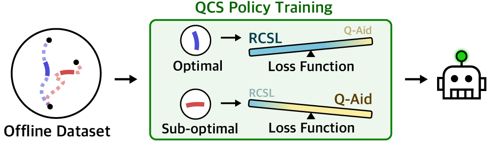

# Adaptive Q-Aid for Conditional Supervised Learning in Offline Reinforcement Learning (QCS)

<p align="center">
  
</p>


&nbsp;
## Acknowledgements
Our QCS code is based on the following code repositories:
- [https://github.com/Manchery/iql-pytorch](https://github.com/Manchery/iql-pytorch)
- [https://github.com/kzl/decision-transformer](https://github.com/kzl/decision-transformer)
- [https://github.com/facebookresearch/online-dt](https://github.com/facebookresearch/online-dt).

Thank you for their amazing work and for sharing their open-source code.


## Requirements
```console
conda env create -n qcs python=3.8
conda activate qcs
pip3 install -r requirements.txt
```

## Datasets
Datasets are stored in the data directory. We provide the Inverted Double Pendulum datasets we created for toy experiments. Run the following script to download the datasets for {MuJoCo, Antmaze, Adroit Pen, Kitchen} and save them in our format:

```console
python3 data/download_d4rl_datasets.py
```

## Example
Experiments can be reproduced using `scripts.sh`. Below, we provide a few example scripts.

```console
# mujoco halfcheetah-medium
python3 main_iql_pretrain.py --env halfcheetah-medium-v2 --expectile 0.7
python3 main_qcs.py --env halfcheetah-medium-v2 --base_arch dc --q_scale 1 --embed_dim 256 --n_layer 4

# antmaze-medium-play
python3 main_iql_pretrain.py --env antmaze-medium-play-v2 --expectile 0.8 --discount 0.995 --layernorm True
python3 main_qcs.py --env antmaze-medium-play-v2 --base_arch dc --q_scale 0.2 --embed_dim 512 --n_layer 3 --conditioning subgoal
```
